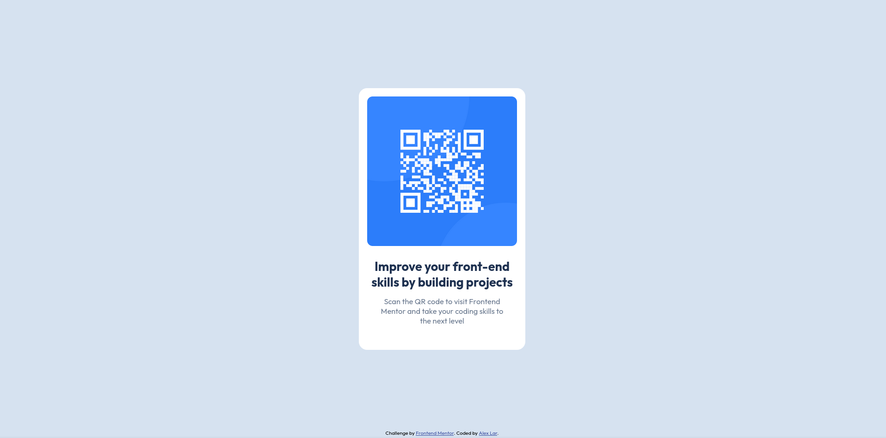

# Frontend Mentor - QR code component solution

This is a solution to the [QR code component challenge on Frontend Mentor](https://www.frontendmentor.io/challenges/qr-code-component-iux_sIO_H). Frontend Mentor challenges help you improve your coding skills by building realistic projects. 

## Table of contents

- [Frontend Mentor - QR code component solution](#frontend-mentor---qr-code-component-solution)
  - [Table of contents](#table-of-contents)
  - [Overview](#overview)
    - [Screenshot](#screenshot)
    - [Links](#links)
  - [My process](#my-process)
    - [Built with](#built-with)
    - [What I learned](#what-i-learned)
    - [Continued development](#continued-development)
  - [Author](#author)


## Overview

### Screenshot



### Links

- Live Site URL: [Github Pages](https://alex-lar.github.io/qr-code-component/)

## My process

### Built with

- Semantic HTML5 markup
- CSS custom properties
- Flexbox
- Mobile-first workflow
- Responsive design wih relative units
- CSS clamp() for fluid typography

### What I learned

While working on this project, I practiced several useful CSS techniques:

1. Responsive text sizing 

I used the `clamp()` function to make text scale smoothly between mobile and desktop:

```css
.card h1 {
  font-size: clamp(1.4rem, 6vw, 1.8rem);
}
```

2. Easy centering 

Making things center both horizontally and vertically is simple with Flexbox:

```css
body {
  display: flex;
  justify-content: center;
  align-items: center;
}
```


### Continued development

For future projects, I want to work on:

1. CSS Grid
2. Accessibility

## Author

- Github - [Alex-Lar](https://github.com/Alex-Lar)
- Frontend Mentor - [@Alex-Lar](https://www.frontendmentor.io/profile/Alex-Lar)
